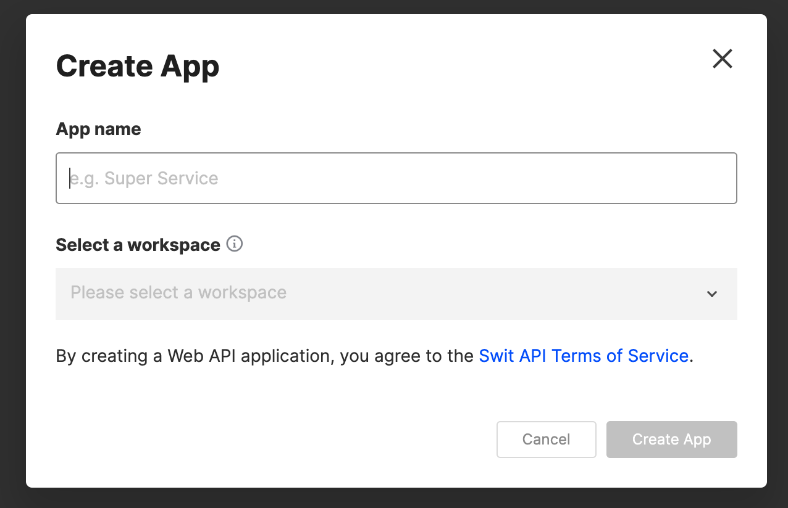
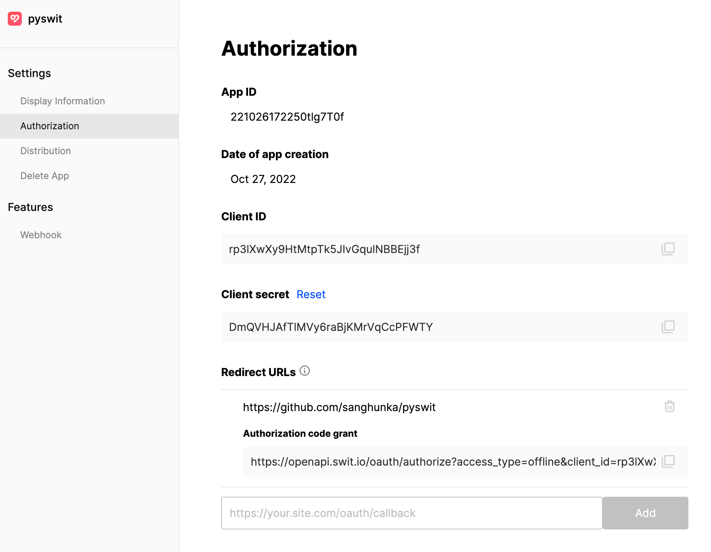

**Table of Contents**

- [Authentication with documentation](#authentication-with-documentation)
- [Authentication with Pyswit](#authentication-with-pyswit)
  - [Register an application on Swit Developers](#register-an-application-on-swit-developers)
  - [User authorization](#user-authorization)
    - [1. Using helper function](#1-using-helper-function)
    - [2. Not using helper function](#2-not-using-helper-function)
  - [Exchange for an access token](#exchange-for-an-access-token)
  - [Refresh the access token](#refresh-the-access-token)

# Authentication with documentation

[Swit official documentation](https://developers.swit.io/documentation#authentication) will guide you through how to implement Swit authentication.

# Authentication with Pyswit

If you have any difficulties in the authentication process with docs, follow this section.

Pyswit will help you.

## Register an application on Swit Developers

- Go to [Swit developer apps page](https://developers.swit.io/apps)
- Click `Create App` button on your Apps page
- Type your app name and select a workspace

<!--  -->


In this doc, I created app and named `pyswit`

- Click created app and Go to Settings->Authorization page
- In this page, you can see `Client ID`, `Client Secret` and `Redirect URLs`
- At first, `Redirect URLs` is not set. Set it.



In this doc, I set `Redirect URLs` to 'https://github.com/sanghunka/pyswit'

## User authorization

- There are two ways

### 1. Using helper function

- Run the following script

```py
from pyswit.oauth import Oauth

oauth = Oauth()
oauth.authorize_helper()
oauth.authorize()
```

- then follow instruction.
- `state` is an optional parameter.
- If you enter your Swit plan(free/standard/advanced) into `scope`, pyswit will set every possible scope.
- Or, you can customize scope. (e.g. scope? message:read+message:write)
- The example results are like below.

```
client_id? rp3lXwXy9HtMtpTk5JIvGqulNBBEjj3f
redirect_uri? https://github.com/sanghunka/pyswit
response_type? [Currently, only 'code' is supported] code
state?
scope? [free/standard/advanced/custom] free

🔗 https://openapi.swit.io/oauth/authorize?client_id=rp3lXwXy9HtMtpTk5JIvGqulNBBEjj3f&redirect_uri=https://github.com/sanghunka/pyswit&response_type=code&state=&scope=channel:read+channel:write+idea:read+idea:write+message:read+message:write+project:read+project:write+task:read+task:write+user:read+workspace:read+workspace:write+approval:read+approval:write

This URL will be redirected to the authentication web page.
Please accept the permission request.

🔗 https://github.com/sanghunka/pyswit?code=<your-code>

Upon confirmation, the user is redirected to this url.
In the query string, <your-code> is authorization code which will be used to exchange for an access token.
```

### 2. Not using helper function

- specify parameters in script and run the script
- The rest is the same as above

```py
from pyswit.oauth import Oauth

client_id = <your-client-id>
redirect_url = <your-redirect-url>
scope = <your-scope>

oauth = Oauth(
    client_id=client_id,
    redirect_uri=redirect_url,
    response_type="code",
    scope=<your-scope>,
)
oauth.authorize()
```

## Exchange for an access token

- Run the following script
- You can get `access_token` and `refresh_token`

```py
from pyswit.oauth import Oauth

client_id = <your-client-id>
client_secret = <your-client-secret>
redirect_url = <your-redirect-url>
code = <your-code>

oauth = Oauth(
    client_id=client_id, client_secret=client_secret, redirect_uri=redirect_url
)
res = oauth.exchange_for_access_token(code)
print(res)
```

## Refresh the access token

```py
from pyswit.oauth import Oauth

client_id = <your-client-id>
client_secret = <your-client-secret>
refresh_token = <your-refresh-token>

oauth = Oauth(client_id=client_id, client_secret=client_secret)
res = oauth.refresh_access_token(refresh_token)
print(res)
```
